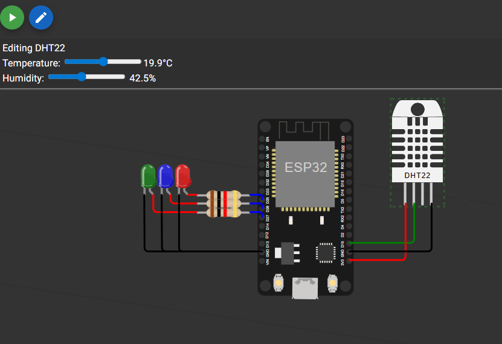

# Wokwi Lab

IoT demo using Wokwi software

## How to use :

- Install Platform.io and Wokwi extensions for VSCode
- Press F1 and type `Wokwi: Start Simulator`
- Use the Terminal tab to read live output

## Useful links

Supported hardware : https://docs.wokwi.com/getting-started/supported-hardware
